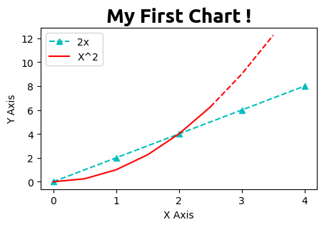
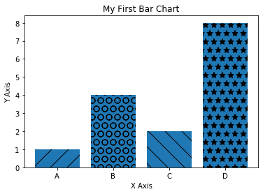
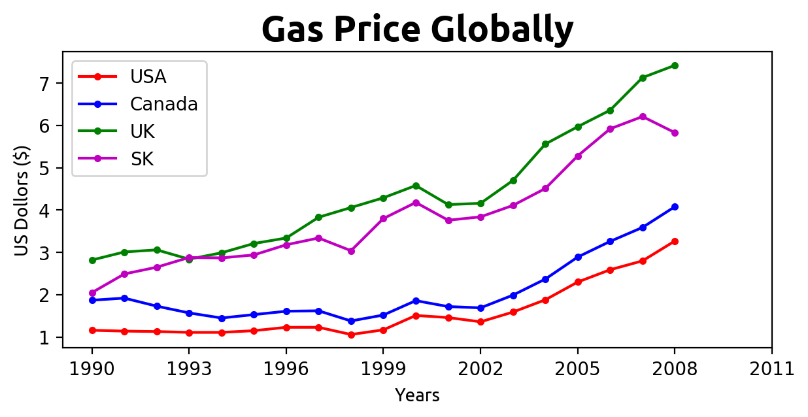
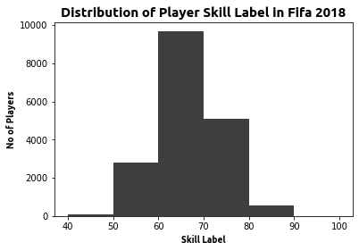
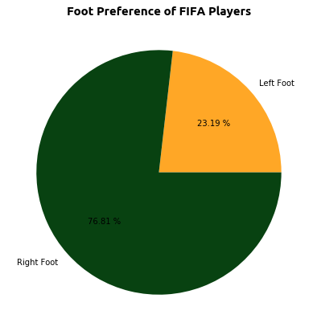
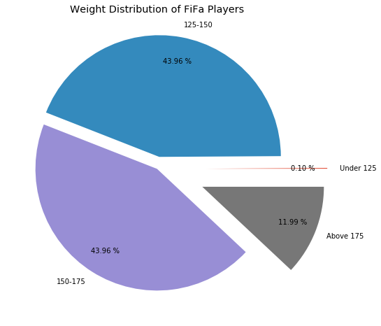
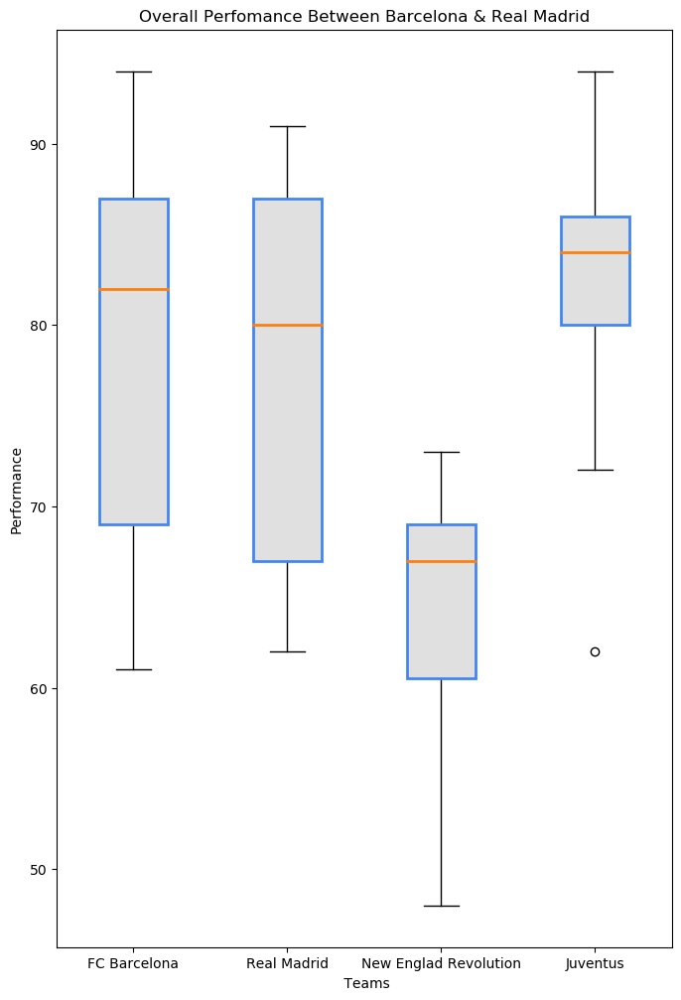

```python
# ENV Setup
# For Dark Theme nad to Rest to Default
# !pip install jupyterthemes

# from jupyterthemes import get_themes
# from jupyterthemes.stylefx import set_nb_theme

# set_nb_theme('onedork')

# !jt -r

```

    Reset css and font defaults in:
    /home/ashutosh/.jupyter/custom &
    /home/ashutosh/.local/share/jupyter/nbextensions


### Load Packages (Initial)


```python
import matplotlib.pyplot as plt
import numpy as np
import pandas as pd
```

# **Basic Graph**


```python
x = [0, 1, 2, 3, 4]
y = [0, 2, 4, 6, 8]

# Resize Your Graph
plt.figure(figsize=(5,3), dpi=100)

# plt.plot(x, y,label="2x", color='red', linewidth=2, marker = '.', markersize = 10, markeredgecolor='blue', linestyle='--')

# Use Shortahnd Notation
# fmt = '[color][marker][line]'
plt.plot(x, y, 'c^--', label = '2x')


# Line Number Two
# select interval we want to plot points at 
x2 = np.arange(0, 4, 0.5)
# print(x2)

# Plot part of the graph as line  
plt.plot(x2[:6],  x2[:6]**2, 'r', label='X^2')

# Plot remainder of the Graph
plt.plot(x2[5:],  x2[5:]**2, 'r--')


# Plot First Line
plt.title('My First Chart !', fontdict={'fontname': 'Ubuntu','fontweight':'bold', 'fontsize' : 20})
plt.xlabel('X Axis')
plt.ylabel('Y Axis')

# X axis, Y axis Tickmarks, (Scale of Your Graph)
plt.xticks([0,1,2,3,4,])
# plt.yticks([0,2,4,6,8,10])

#Legend (Measurement)
plt.legend()

# Saviing a Figure(Chart)
# plt.savefig('savemyGraph.png', dpi = 300)

# Show Plot
plt.show()
```





**Bar Chart**


```python
labels = ['A', 'B', 'C', 'D']
values = [1,4,2, 8]

plt.title('My First Bar Chart')
plt.xlabel('X Axis')
plt.ylabel('Y Axis')

bars = plt.bar(labels, values)

patterns = ['/', 'O','\ ', '*']

for bar in bars:
  bar.set_hatch(patterns.pop(0))

# bars[0].set_hatch('/')
# bars[1].set_hatch('O')
# bars[2].set_hatch('\ ')
# bars[3].set_hatch('*')

plt.figure(figsize=(6,4))


plt.show()
```





    <Figure size 432x288 with 0 Axes>


### Real World Graphs
Download Data From Guthub https://github.com/ashutosh4336
#### Line Graph


```python
gas = pd.read_csv('./data/gas_prices.csv')
# print(gas)
# Figure Size
plt.figure(figsize=(7,3), dpi=200)

plt.title('Gas Price Globally', fontdict={'fontname': 'Ubuntu','fontweight':'bold', "fontsize": '20'})
plt.xlabel('Years', fontdict={'fontname' : 'Ubuntu', 'fontsize' : '10'})
plt.ylabel('US Dollors ($)', fontdict={'fontname' : 'Ubuntu', 'fontsize' : '10'})

plt.plot(gas.Year, gas.USA, 'r.-', label="USA")
plt.plot(gas.Year, gas.Canada, 'b.-', label="Canada")
plt.plot(gas.Year, gas.UK, 'g.-', label="UK")
plt.plot(gas.Year, gas['South Korea'],'m.-', label="SK")

# for country in gas:
#     if country != 'Year':
#         print(country)
# #         print(country)
#         plt.plot(gas.Year, gas[country],  marker='.')


# print(gas.Year[::2])
plt.xticks(gas.Year[::3].tolist() + [2011])


plt.savefig('gas_price_figure', dpi=300)


plt.legend()
plt.show()
```





### Load FiFa Data


```python
fifa = pd.read_csv('./data/fifa_data.csv')
fifa.head(5)
```


<div>
<style scoped>
    .dataframe tbody tr th:only-of-type {
        vertical-align: middle;
    }

    .dataframe tbody tr th {
        vertical-align: top;
    }

    .dataframe thead th {
        text-align: right;
    }
</style>
<table border="1" class="dataframe">
  <thead>
    <tr style="text-align: right;">
      <th></th>
      <th>Unnamed: 0</th>
      <th>ID</th>
      <th>Name</th>
      <th>Age</th>
      <th>Photo</th>
      <th>Nationality</th>
      <th>Flag</th>
      <th>Overall</th>
      <th>Potential</th>
      <th>Club</th>
      <th>...</th>
      <th>Composure</th>
      <th>Marking</th>
      <th>StandingTackle</th>
      <th>SlidingTackle</th>
      <th>GKDiving</th>
      <th>GKHandling</th>
      <th>GKKicking</th>
      <th>GKPositioning</th>
      <th>GKReflexes</th>
      <th>Release Clause</th>
    </tr>
  </thead>
  <tbody>
    <tr>
      <th>0</th>
      <td>0</td>
      <td>158023</td>
      <td>L. Messi</td>
      <td>31</td>
      <td>https://cdn.sofifa.org/players/4/19/158023.png</td>
      <td>Argentina</td>
      <td>https://cdn.sofifa.org/flags/52.png</td>
      <td>94</td>
      <td>94</td>
      <td>FC Barcelona</td>
      <td>...</td>
      <td>96.0</td>
      <td>33.0</td>
      <td>28.0</td>
      <td>26.0</td>
      <td>6.0</td>
      <td>11.0</td>
      <td>15.0</td>
      <td>14.0</td>
      <td>8.0</td>
      <td>€226.5M</td>
    </tr>
    <tr>
      <th>1</th>
      <td>1</td>
      <td>20801</td>
      <td>Cristiano Ronaldo</td>
      <td>33</td>
      <td>https://cdn.sofifa.org/players/4/19/20801.png</td>
      <td>Portugal</td>
      <td>https://cdn.sofifa.org/flags/38.png</td>
      <td>94</td>
      <td>94</td>
      <td>Juventus</td>
      <td>...</td>
      <td>95.0</td>
      <td>28.0</td>
      <td>31.0</td>
      <td>23.0</td>
      <td>7.0</td>
      <td>11.0</td>
      <td>15.0</td>
      <td>14.0</td>
      <td>11.0</td>
      <td>€127.1M</td>
    </tr>
    <tr>
      <th>2</th>
      <td>2</td>
      <td>190871</td>
      <td>Neymar Jr</td>
      <td>26</td>
      <td>https://cdn.sofifa.org/players/4/19/190871.png</td>
      <td>Brazil</td>
      <td>https://cdn.sofifa.org/flags/54.png</td>
      <td>92</td>
      <td>93</td>
      <td>Paris Saint-Germain</td>
      <td>...</td>
      <td>94.0</td>
      <td>27.0</td>
      <td>24.0</td>
      <td>33.0</td>
      <td>9.0</td>
      <td>9.0</td>
      <td>15.0</td>
      <td>15.0</td>
      <td>11.0</td>
      <td>€228.1M</td>
    </tr>
    <tr>
      <th>3</th>
      <td>3</td>
      <td>193080</td>
      <td>De Gea</td>
      <td>27</td>
      <td>https://cdn.sofifa.org/players/4/19/193080.png</td>
      <td>Spain</td>
      <td>https://cdn.sofifa.org/flags/45.png</td>
      <td>91</td>
      <td>93</td>
      <td>Manchester United</td>
      <td>...</td>
      <td>68.0</td>
      <td>15.0</td>
      <td>21.0</td>
      <td>13.0</td>
      <td>90.0</td>
      <td>85.0</td>
      <td>87.0</td>
      <td>88.0</td>
      <td>94.0</td>
      <td>€138.6M</td>
    </tr>
    <tr>
      <th>4</th>
      <td>4</td>
      <td>192985</td>
      <td>K. De Bruyne</td>
      <td>27</td>
      <td>https://cdn.sofifa.org/players/4/19/192985.png</td>
      <td>Belgium</td>
      <td>https://cdn.sofifa.org/flags/7.png</td>
      <td>91</td>
      <td>92</td>
      <td>Manchester City</td>
      <td>...</td>
      <td>88.0</td>
      <td>68.0</td>
      <td>58.0</td>
      <td>51.0</td>
      <td>15.0</td>
      <td>13.0</td>
      <td>5.0</td>
      <td>10.0</td>
      <td>13.0</td>
      <td>€196.4M</td>
    </tr>
    <tr>
      <th>...</th>
      <td>...</td>
      <td>...</td>
      <td>...</td>
      <td>...</td>
      <td>...</td>
      <td>...</td>
      <td>...</td>
      <td>...</td>
      <td>...</td>
      <td>...</td>
      <td>...</td>
      <td>...</td>
      <td>...</td>
      <td>...</td>
      <td>...</td>
      <td>...</td>
      <td>...</td>
      <td>...</td>
      <td>...</td>
      <td>...</td>
      <td>...</td>
    </tr>
    <tr>
      <th>18202</th>
      <td>18202</td>
      <td>238813</td>
      <td>J. Lundstram</td>
      <td>19</td>
      <td>https://cdn.sofifa.org/players/4/19/238813.png</td>
      <td>England</td>
      <td>https://cdn.sofifa.org/flags/14.png</td>
      <td>47</td>
      <td>65</td>
      <td>Crewe Alexandra</td>
      <td>...</td>
      <td>45.0</td>
      <td>40.0</td>
      <td>48.0</td>
      <td>47.0</td>
      <td>10.0</td>
      <td>13.0</td>
      <td>7.0</td>
      <td>8.0</td>
      <td>9.0</td>
      <td>€143K</td>
    </tr>
    <tr>
      <th>18203</th>
      <td>18203</td>
      <td>243165</td>
      <td>N. Christoffersson</td>
      <td>19</td>
      <td>https://cdn.sofifa.org/players/4/19/243165.png</td>
      <td>Sweden</td>
      <td>https://cdn.sofifa.org/flags/46.png</td>
      <td>47</td>
      <td>63</td>
      <td>Trelleborgs FF</td>
      <td>...</td>
      <td>42.0</td>
      <td>22.0</td>
      <td>15.0</td>
      <td>19.0</td>
      <td>10.0</td>
      <td>9.0</td>
      <td>9.0</td>
      <td>5.0</td>
      <td>12.0</td>
      <td>€113K</td>
    </tr>
    <tr>
      <th>18204</th>
      <td>18204</td>
      <td>241638</td>
      <td>B. Worman</td>
      <td>16</td>
      <td>https://cdn.sofifa.org/players/4/19/241638.png</td>
      <td>England</td>
      <td>https://cdn.sofifa.org/flags/14.png</td>
      <td>47</td>
      <td>67</td>
      <td>Cambridge United</td>
      <td>...</td>
      <td>41.0</td>
      <td>32.0</td>
      <td>13.0</td>
      <td>11.0</td>
      <td>6.0</td>
      <td>5.0</td>
      <td>10.0</td>
      <td>6.0</td>
      <td>13.0</td>
      <td>€165K</td>
    </tr>
    <tr>
      <th>18205</th>
      <td>18205</td>
      <td>246268</td>
      <td>D. Walker-Rice</td>
      <td>17</td>
      <td>https://cdn.sofifa.org/players/4/19/246268.png</td>
      <td>England</td>
      <td>https://cdn.sofifa.org/flags/14.png</td>
      <td>47</td>
      <td>66</td>
      <td>Tranmere Rovers</td>
      <td>...</td>
      <td>46.0</td>
      <td>20.0</td>
      <td>25.0</td>
      <td>27.0</td>
      <td>14.0</td>
      <td>6.0</td>
      <td>14.0</td>
      <td>8.0</td>
      <td>9.0</td>
      <td>€143K</td>
    </tr>
    <tr>
      <th>18206</th>
      <td>18206</td>
      <td>246269</td>
      <td>G. Nugent</td>
      <td>16</td>
      <td>https://cdn.sofifa.org/players/4/19/246269.png</td>
      <td>England</td>
      <td>https://cdn.sofifa.org/flags/14.png</td>
      <td>46</td>
      <td>66</td>
      <td>Tranmere Rovers</td>
      <td>...</td>
      <td>43.0</td>
      <td>40.0</td>
      <td>43.0</td>
      <td>50.0</td>
      <td>10.0</td>
      <td>15.0</td>
      <td>9.0</td>
      <td>12.0</td>
      <td>9.0</td>
      <td>€165K</td>
    </tr>
  </tbody>
</table>
<p>18207 rows × 89 columns</p>
</div>


### Histograms


```python
bins = [40,50,60,70,80,90,100]

plt.hist(fifa.Overall, bins=bins, color='#3e3e3e')

plt.xticks(bins)

plt.title('Distribution of Player Skill Label in Fifa 2018', fontdict={'fontname':'Ubuntu', 'fontsize': '15','fontweight':'bold'})
plt.xlabel('Skill Label', fontdict={'fontname':'Ubuntu', 'fontsize': '10','fontweight':'bold'})
plt.ylabel('No of Players', fontdict={'fontname':'Ubuntu', 'fontsize': '10','fontweight':'bold'})

plt.show()
```





```python
#simple PI Chart
left = fifa.loc[fifa['Preferred Foot'] == 'Left'].count()[0]
right = fifa.loc[fifa['Preferred Foot'] == 'Right'].count()[0]

plt.figure(figsize=(10, 7))

print(left, right)

labels = ['Left Foot', 'Right Foot']

colors = ['#ffa726', '#084211']
# One Line Soliution (Messy)
# plt.pie([fifa.loc[fifa['Preferred Foot'] == 'Left'].count()[0], fifa.loc[fifa['Preferred Foot'] == 'Right'].count()[0]])

# Simplified
plt.pie([left, right], labels = labels, colors=colors,autopct='%.2f %%')


plt.title('Foot Preference of FIFA Players', fontdict={'fontname':'ubuntu', 'fontweight':'bold', 'fontsize':'15'})

plt.show()
```

    4211 13948





```python
# Advanced Pi Chart
# print(fifa.Weight)

# x = fifa.Weight[6][:-3]
# x = int(x)


fifa.Weight = [int(x.strip('lbs')) if type(x)==str else x  for x in fifa.Weight]

# print(fifa.Weight[0])

lightPlayers = fifa.loc[fifa.Weight < 125].count()[0]

lightMediumPlayers = fifa.loc[fifa.Weight >= 125 & (fifa.Weight < 150)].count()[0]

mediumPlayers = fifa.loc[fifa.Weight >= 150 & (fifa.Weight < 175)].count()[0]


heavyPlayers = fifa.loc[fifa.Weight >= 175].count()[0]


# print(lightPlayers, lightMediumPlayers, mediumPlayers, mediumHeavyPlayers, heavyPlayers)

weights = [lightPlayers, lightMediumPlayers, mediumPlayers, heavyPlayers]
# print(weights)
labels = ['Under 125', '125-150', '150-175', 'Above 175']

explode= (0.4, 0.1, 0, 0.4)


plt.style.use('ggplot')
plt.figure(figsize=(13,8))
plt.pie(weights, labels = labels, autopct='%.2f %%', pctdistance=0.8, explode=explode)
plt.title('Weight Distribution of FiFa Players')
plt.show()

plt.savefig('WeightDist.png')
# print(type(x), x)
```





    <Figure size 432x288 with 0 Axes>


```python
plt.style.use('default')

plt.figure(figsize=(8, 12))

barcelona = fifa.loc[fifa.Club == 'FC Barcelona']['Overall']
madrid = fifa.loc[fifa.Club == 'Real Madrid']['Overall']
ner = fifa.loc[fifa.Club == 'New England Revolution']['Overall']
juventus = fifa.loc[fifa.Club == 'Juventus']['Overall']

# print(barcelona, madrid)
plt.title('Overall Perfomance Between Barcelona & Real Madrid')
plt.xlabel(' Teams')
plt.ylabel('Performance')

labels = ['FC Barcelona', 'Real Madrid', 'New Englad Revolution', 'Juventus']


boxes = plt.boxplot([barcelona, madrid, ner, juventus], labels=labels, patch_artist=True, medianprops={ 'linewidth':2 })

for box in boxes['boxes']:
    # Set Edge Colour
    box.set(color='#4286f4', linewidth=2)
    
    # Change Fill Colour
    box.set(facecolor='#e0e0e0')

plt.savefig('temperfomance.png', dpi=300)
plt.show()

```





```python

```
